# Universe 25 Walkthroughs

This is a focused collection of walkthroughs for all Universe 25 demos to allow you to easily follow along and either enable yourself, or have a customer-presentation without having to compose your own demo flow. The order is somewhat opinionated to allow for a smooth transition between features, but feel free to jump around as you see fit.

> [!NOTE]
> Post-Universe, these walkthroughs will be integrated into the standard walkthroughs.

## Overview

This is a high-level overview of all the walkthroughs included in this document, combined with potential necessary manual prep work you will have to execute before being able to demo these features:

| Feature Area         | Walkthrough                                                                                                                                                   | Prep Work                                                                                                                                                                                                                                |
| :------------------- | :------------------------------------------------------------------------------------------------------------------------------------------------------------ | :--------------------------------------------------------------------------------------------------------------------------------------------------------------------------------------------------------------------------------------- |
| **VSCode / Copilot** | [**Planning Mode in VSCode**](#planning-mode-in-vscode-copilot-): Use Copilot Chat's `Plan` mode to outline a new feature.                                    | Requires **VSCode Insiders** and ideally GitHub Remote MCP setup.                                                                                                                                                                        |
| **Copilot**          | [**Mission Control**](#mission-control-copilot-️): Manage multiple Copilot Coding Agent sessions from a central dashboard.                                     | Assign an issue to Copilot before the demo to have a completed session to show.                                                                                                                                                          |
| **Copilot**          | [**Custom Agents**](#custom-agents-copilot-): Use repository-specific custom agents like `BDD Specialist` for targeted tasks.                                 | None, custom agents are prepped in the repo for you.                                                                                                                                                                                     |
| **Copilot**          | [**Copilot Code Review**](#copilot-code-review-copilot-): Let Copilot review a PR, using tools like CodeQL and ESLint to find issues.                         | Assign CCR to the existing PR `Feature: Add ToS Download` or create a new PR for the `feature-add-cart-page` branch.                                                                                                                     |
| **Copilot**          | [**Group Changes in PRs**](#copilot-group-changes-in-prs-copilot-): Copilot automatically groups related file changes in a PR for easier review.              | Either:<br>- Create a new PR from the `feature-add-cart-page` branch.<br>- Create a new commit in the `feature-add-tos-download` branch / PR.                                                                                            |
| **GHAS**             | [**Code Quality**](#code-quality-demo): Enable and review Code Quality findings, and use Copilot to generate fixes.                                           | - Manually enable Code Quality in repository settings before the demo.<br>- Make a commit to the PR `Feature: Add ToS Download` to kick-off AI Scanning in the PR.<br/>- Alternatively, open a PR for the `feature-add-cart-page` branch |
| **Copilot / GHAS**   | [**CCA uses CodeQL Tooling**](#cca-uses-codeql-tooling-copilot-): The Copilot Coding Agent runs a CodeQL scan at the end of each session.                     | Use the prompt in this section to Kick-Off an CCA that will introduce a security vulnerability                                                                                                                                           |
| **Copilot / GHAS**   | [**Assign CodeQL Alerts to CCA**](#assign-codeql-alerts-to-coding-agents-copilot-): Assign CodeQL alerts with autofixes directly to the Coding Agent.         | Generate an autofix for an alert before assigning it. For bulk assignment, a security campaign is needed.                                                                                                                                |
| **GHAS**             | [**Secret Scanning with Additional Metadata**](#secret-scanning-with-additional-metadata-): Verify secrets and view extended metadata for leaked credentials. | (optional) Manually enable "Extended metadata" for secret scanning in repository settings - you can also make the enablement part of the demo, it immediately executes.                                                                  |
| **Copilot**          | [**AI Controls**](#copilot-control-plane-ai-controls-copilot-): Manage enterprise-level AI features, including agent rulesets and MCP allowlists.             | Requires access to an enterprise administration account.                                                                                                                                                                                 |

### Possiblity for two PRs

All PR related features come in two flavors, depending if you want to **have it all** or you prefer a **more focused universe demo**:

- Demo it all - `feature-add-tos-download`: This comes in a pre-created PR `Feature: Add ToS Download` and has all feature to demo CodeQL, CCR, Code Quality, Group Changes, Dependency Review
- Demo it focused - `feature-add-cart-page`: This does **not** come with a pre-created PR (you have to create it yourself), but the branch is more focused on the universe-ships, so it only contains CCR and **Code-Quality** Issues.

## Planning Mode in VSCode :copilot: 📝

> [!IMPORTANT]
> Only available in **VSCode Insiders**. This will ship to native VSCode with the November VSCode update.

1. Open the demo repository in **VSCode Insiders**.
2. Open Copilot Chat and switch to `Plan` Mode.
  
    

3. Use the following prompt to kick off a planning session:

    ```txt
    I need to implement a cart feature in this application. Help me plan that.
    ```

4. Copilot will first retrieve some information and then come back to you with some questions (CAUTION: They might not be exactly the same as below, so just get creative):

    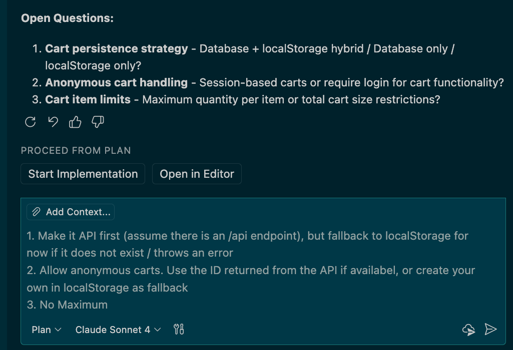

5. Answer the questions accordingly. Copilot might come back with more questions. You can decide whether to keep answering them or, at some point, turn the plan into action.

6. Choose one of the following actions:
    
    1. Click `Start Implementation` to have Agent Mode implement the plan right away.
    2. Click `Open in Editor` to store the plan in a markdown file.
    3. Switch to `Agent` Mode and prompt Copilot to hand this over to the Coding Agent (requires MCP to be started):

        ```txt
        Can you hand this plan over to coding agent?
        ```

## Mission Control :copilot: 🛰️

Mission Control is a user-level feature, accessible at <https://github.com/copilot/agents>, that displays all ongoing agent tasks. As it is mostly a "show and tell" feature, we've created a list of coding agents for you to kick off, followed by a [suggested (opinionated) demo flow](#opinionated-mission-control-demo).

### Prep: Agents to Kick-Off

- **Directly from Mission Control**: This is the easiest way, perfect if you want to start in Mission Control. Here are two example prompts to get you started:
  - **[Simple] Add ESLint Rule**: This is a quick one with a good impact because CCA will also fix all code to comply with the new rules.

      ```txt
      Add an ESLint rule to enforce semicolons
      ```
  
      Then you can also show how to steer Copilot mid-session:

      ```txt
      While you're at it, also add a rule to enforce double-quotes over single quotes
      ```

    After the session is done, kick off the next one with:

      ```txt
      Find a rule to disallow UPPER_CASE variables and only warn about it.
      ```

  - **[Medium] Add BDD Tests**: Select the `BDD Specialist` custom agent (see [Custom Agents](#custom-agents-copilot-) below) and use this prompt:

      ```txt
      Add BDD tests for the ToS Download feature
      ```

  - **[Complex] Fix view issue**: Copilot will chew on this for a bit, but it's great to demo mid-session how it will find the issue and use Playwright MCP to validate its fix:

      ```txt
      On the main page, for large screens, the "Smart Tech CAT" textbox does not stay within the hero image but flows out of it on the right side. Change it so that it will always be entirely within the image's boundaries, with some padding to the right of the image.
      ```

  - **From Issue(s)**: (Bulk) assign the following two issues to CCA:
  - `Improve test coverage for API`
  - `Move "Terms and conditions" to the bottom of the "Helpful Links" list`
- **CodeQL Alerts:** You have to generate autofixes before you can assign them to CCA. See [Assign CodeQL Alerts to Coding Agents](#copilot--assign-codeql-alerts-to-coding-agents) below.
  - `Database query built from user-controlled sources`
  - `Workflow does not contain permissions`

### Demo: Opinionated Mission Control Walktrough

1. **Assign Issue**: Pre-Demo: Assign the issue `Improve test coverage for API` to Copilot so you have a finished session to show.
2. **Kick-Off Agents Live**: Kick off the demo by assigning multiple tasks to the Coding Agent from the list above (don't use the ESLint one yet).

3. **Mission Control Overview**: Navigate to <https://github.com/copilot/agents>, then:
    1. Explain the purpose of Mission Control and its key features.
    2. Highlight the right side with an overview of all agents and conversations.
    3. Showcase the open sessions.
    4. Kick off a new session with the ESLint Rule from above.

    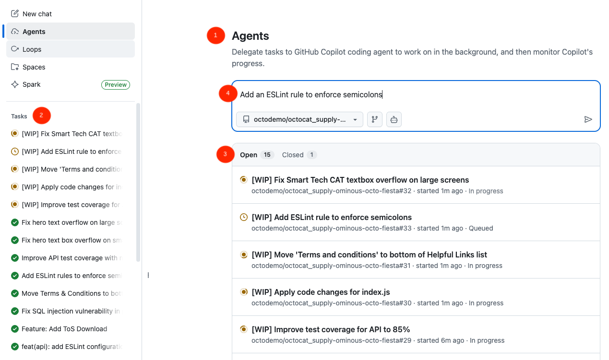

4. **Session Overview**: Pick the running ESLint task and navigate to its session view by clicking on it.
    1. **Session Progress:** Highlight the session progress view and how it provides a live view into the Commands, MCP Servers, and other steps CCA is taking.
    2. **Overview & Files Changed Tab:** Showcase how Copilot keeps a summary in the Overview and how you can see all files changed in the Files Changed tab.
    3. **Switch Tasks:** Show how to easily switch between tasks on the left side.
    4. **Steer Copilot:**
        1. **Mid-Session:** Ask Copilot to add one more ESLint rule.
        2. **End of Session:** Trigger a new session for a completed task. Depending on whether ESLint is done, you might want to switch to the Unit-Test Tasks assigned before the demo and use this query:

          ```txt
          Improve the handling of the mock data. Use a mock-database and mock-objects.
          ```

    5. **Jump to PR or Codespace:** On the top right, you can directly jump to either the PR created by the agent or open the Codespace where the agent did its work to finalize it, concluding the Mission Control demo.

    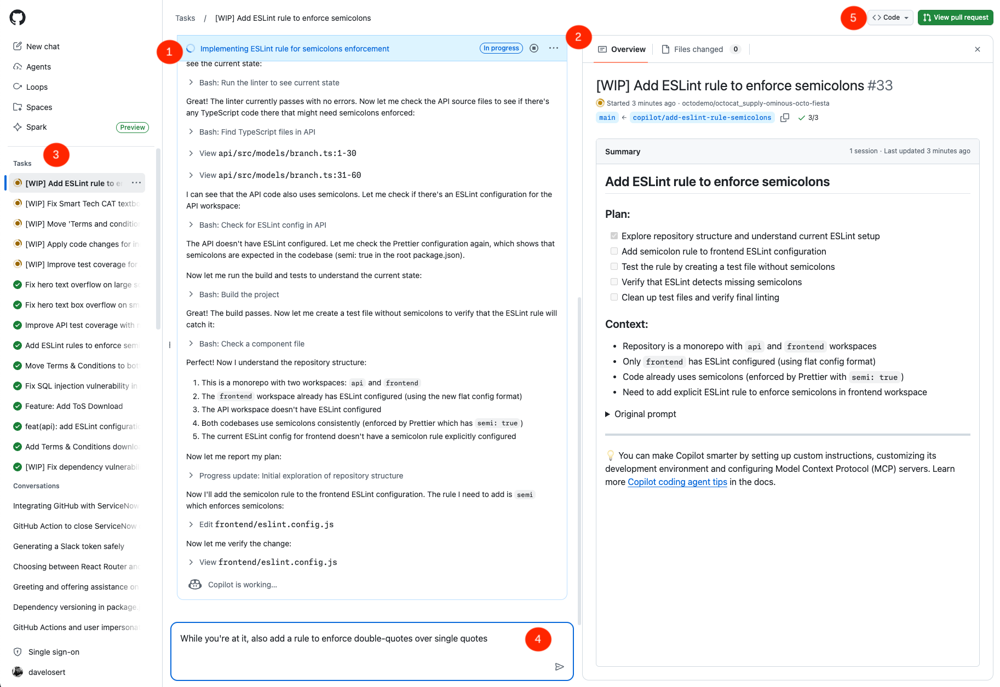

> [!TIP]
>
> - **Add Custom Agent Demo:** You can easily combine this with the [Custom Agents](#custom-agents-copilot-) demo by kicking off the `BDD Specialist` or `API Specialist` from the list above.
> - **Demo Flow:** In step 5, go to the PR and jump directly into the [Copilot Code Review](#copilot-code-review-copilot-) Demo.
> - **Run at least one coding agent before the Demo**: The coding agent takes a while and might not finish in time for your demo. This way, you'll have a finished session.
> - **Preselect the Demo Repo in Mission Control:** Have a tab open with Mission Control, where you've already selected your demo repository as the target. The repo search is currently a bit tedious and slow—this way, you don't lose valuable demo time searching for your demo repo.
> - **Kick off multiple agents:** Pick a few (or all) from the list above, the ones you feel most comfortable demoing. Mission Control is all about managing multiple agents, so this is what you should show.

## Custom Agents :copilot: 🤖

Custom Agents are a new feature that allows you to create your own agents with custom prompts and toolsets. They reside in the `.github/agents` folder of your repository, or can now also be defined centrally for entire enterprises as seen in the [Custom Agents Configuration and Rulesets Walkthrough at the end of this document](#12-custom-agents-configuration-and-rulesets).

> [!IMPORTANT]
> VSCode's `ChatModes` are becoming `Agents`. The functionality is the same, but the naming has changed to better reflect their purpose.

### BDD Agent

1. Navigate to the demo repository.
2. Open the `.github/agents/bdd-specialist.md` file and showcase it to your customers.
3. On the top right, click the Agents Panel.
    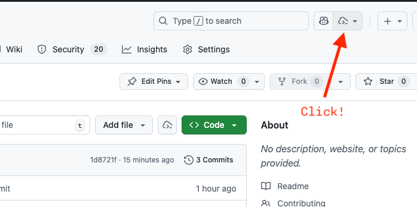  
4. Select the `feature-add-tos-download` branch.
    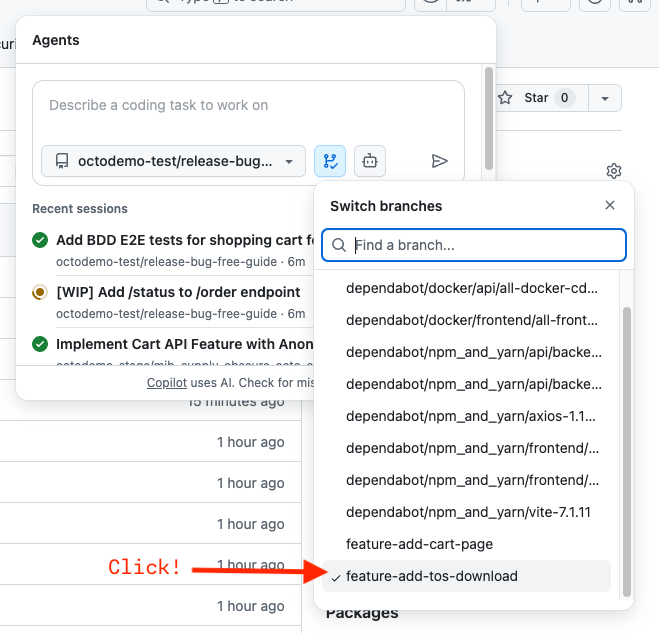

5. Select the `BDD Specialist` agent.

    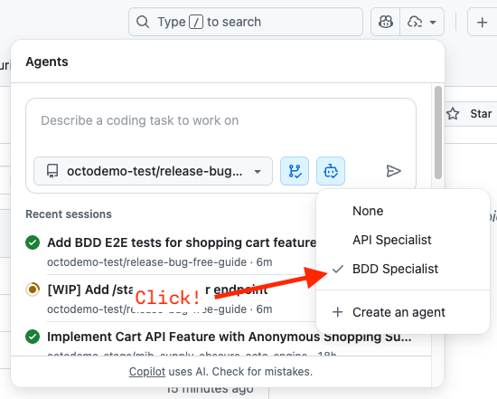

6. Type the following prompt and start the session:

    ```txt
    Add comprehensive BDD Tests to the ToS Download feature!
    ```

    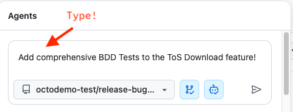

7. Go to Mission Control to showcase the running session (see [Mission Control](#copilot-mission-control) for details on how to demo it).
8. During or after the session, highlight how the `BDD Specialist` agent can be used with little to no prompting and still come up with a sophisticated BDD test suite.

> [!TIP]
> In the list of custom agents, you will see the `Documentation Specialist` and the `Compliance Bot` - these are custom agents defined on the enterprise level - you can hint at them, but defer more explanation once you reach the [Custom Agents Configuration and Rulesets](#12-custom-agents-configuration-and-rulesets) demo.

#### Alternative 1: Use Cart Feature

Alternatively, you can use the `add-cart-page` branch to demo this feature with the prompt:

```txt
Add comprehensive BDD Tests to the Cart Page feature!
```

### Alternative 2: Use `API Specialist`

Follow the same steps as above, but use the `API Specialist` located in `.github/agents/api-specialist.md` and the prompt:

```txt
Implement a new Cart API endpoint with a `POST /cart` request that returns a cartId, and CRUD endpoints where that API can be used as `/cart/:cartId`.
```

## Copilot Code Review :copilot: 👀

> [!WARNING]
> The new CCR features are still behind a feature flag and will only be available after the Keynote on Tuesday.

Copilot Code Review (CCR) now comes with additional capabilities:

- **Better context awareness** by accessing the Code Graph
- **Additional tool calling** with CodeQL and ESLint as the first supported tools
- **Execution in Actions** for better visibility and auditability
- **The ability to hand off suggestions to a Coding Agent** for quicker implementation, even for more sophisticated fixes

### Copilot Code Review Demo Flow

1. **Assign CCR to PR:** In the demo repository, find the PR `Feature: Add ToS Download` and assign Copilot as a reviewer.
2. **Navigate to Actions:** CCR will now execute within GitHub Actions. You can find it in `Actions` → `Copilot Code Review`.

    

   1. **CodeQL Analysis:** Highlight how CCR now uses a CodeQL Scan out of the box.

      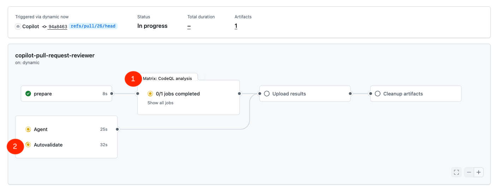

   2. **Autovalidated (for ESLint):** Navigate to the `Autovalidate` job. In there, you'll find a step called `Run ESLint`. Use this to highlight how CCR can now run ESLint as part of its review.

      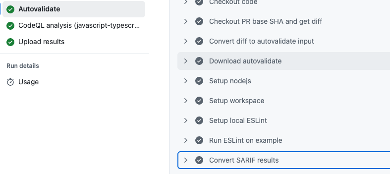

3. **Review Findings:** Once the review is done, go back to the PR. Now, here is the tricky part: Given Copilot's non-deterministic behavior, the findings might differ from demo to demo. If there isn't a matching finding, either try re-assigning Copilot again or just talk through the findings customers can additionally expect:

   1. **[CodeQL] Found Vulnerability:** Thanks to the CodeQL scan, CCR found a path traversal vulnerability in the new endpoint.

      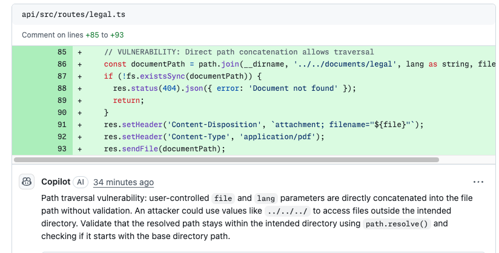

   2. **[ESLint] Rule Violation:** CCR found an issue thanks to the ESLint run that yields an error (this is also found by our CI Workflow, but with CCR, we get an easy fix).

      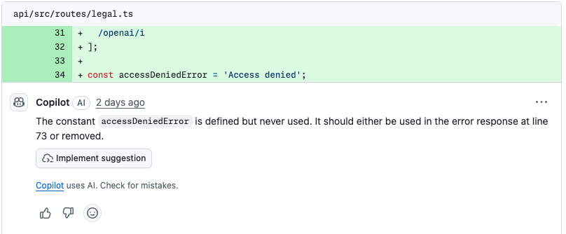

   3. **[Instructions] Missing Swagger:** Show how CCR found missing Swagger documentation for the new endpoint. This finding stems from the instructions file in `.github/instructions/api.instructions.md`. You can open the file to show how CCR digests instructions files to improve its review.

      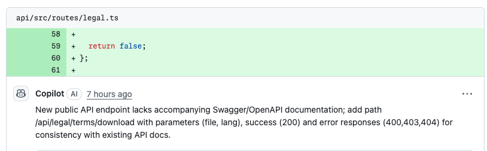

   4. **Additional Context:** CCR uses the Code Graph to find additional context that is **not** part of the PR. This is an example of that: The PR does not contain anything about React Query.

      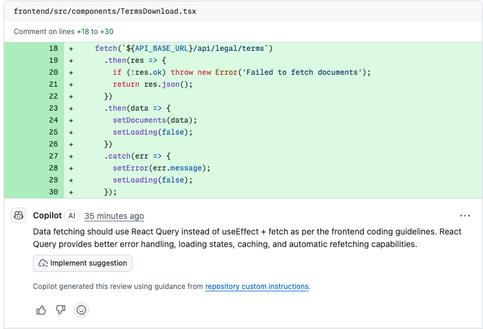

4. **`Implement Suggestions`:** Lastly, explain how we can hand over the implementation of all findings to CCA at the click of a button.

    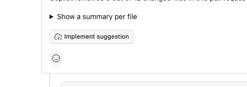

## Copilot Group Changes in PRs :copilot: 📦

> [!WARNING]
> Group Changes will only appear in a PR created or edited by a human, which is why it won't appear in the existing `Feature: Add ToS Download` PR. We've added an additional branch, `feature-add-cart-page`, for you to easily demo this feature.

1. Open a pull request from the `feature-add-cart-page` branch to the `main` branch (it should prompt you when you access the demo repo for the first time).
2. Navigate to the `Files changed` tab of the PR.
3. On the top right, showcase how Copilot grouped changes into logical sections, making it easier to review and understand the modifications.

  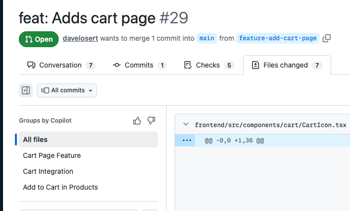

> [!TIP]
> You can alternatively make a fake commit to the existing `Feature: Add ToS Download` PR (add a comment somewhere) to trigger group changes. You can also combine this with the [Code Quality Demo](#-code-quality-demo), which requires this step anyway.

## Code Quality 

### Prep: Turn On Code Quality
>
> [!TIP]
> Unfortunately, this is a manual step today as there are no APIs to handle this yet. Also, as it can take a few minutes to be enabled, we recommend taking this step right after demo creation and with enough time before your actual demo.

1. Navigate to the `Settings` tab of your demo repository.
2. Click `Code Quality` in the left sidebar.
3. Click `Enable Code Quality` to turn on the feature.
  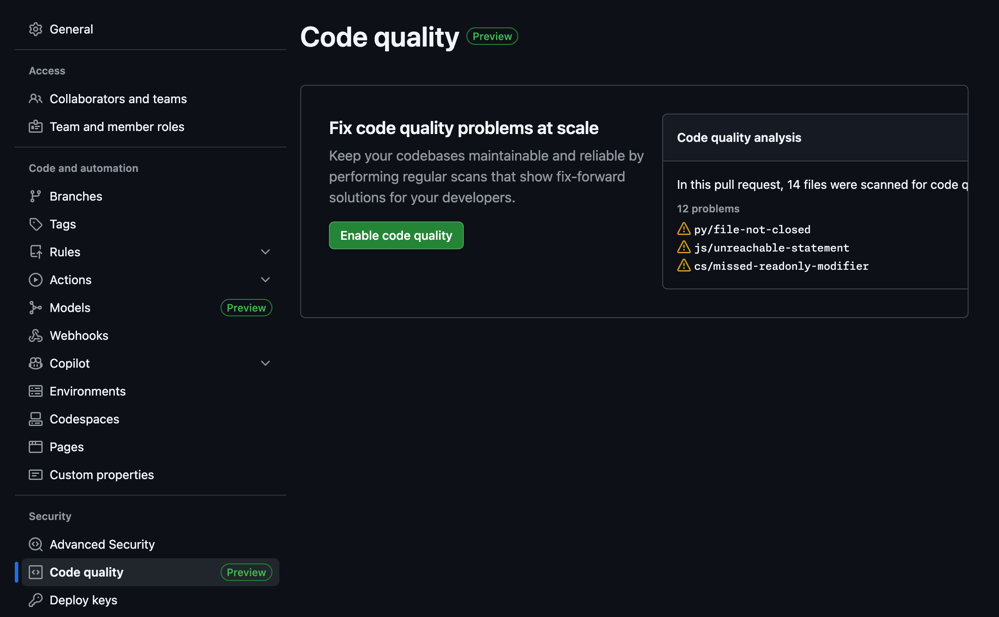
4. Wait a few minutes for Code Quality to analyze the repository.
5. Once enabled, do a commit to the main-branch to also kick-off AI Scanning in the main branch.

### Demo: Review Code Quality Findings and Generate Fixes with Copilot

1. To view the Code Quality results, click the `Security` tab, then select `All findings` under `Code Quality` from the left sidebar.
  
2. Select any of the finding rules to view a list of findings for that rule.
3. Click `Show more` to review details of the code quality finding and review the recommendation and examples provided.
4. Click `Show less` to collapse the view to focus on the findings.
5. The findings will be highlighted. The next action you can take is to click the `Generate fix` button to create a fix using Copilot to address the issue. Wait for Copilot to finish creating the fix.
  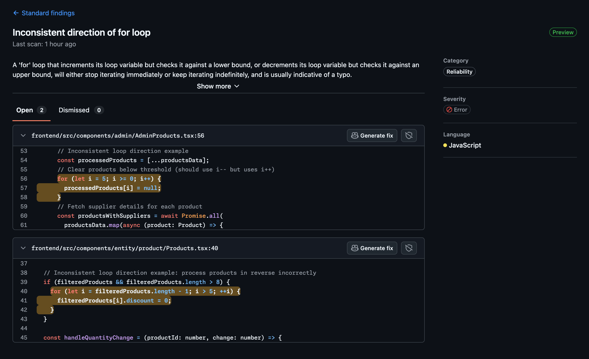
6. Once the fix is presented in the UI, you can click `Open pull request` to create a PR with the suggested fix.
  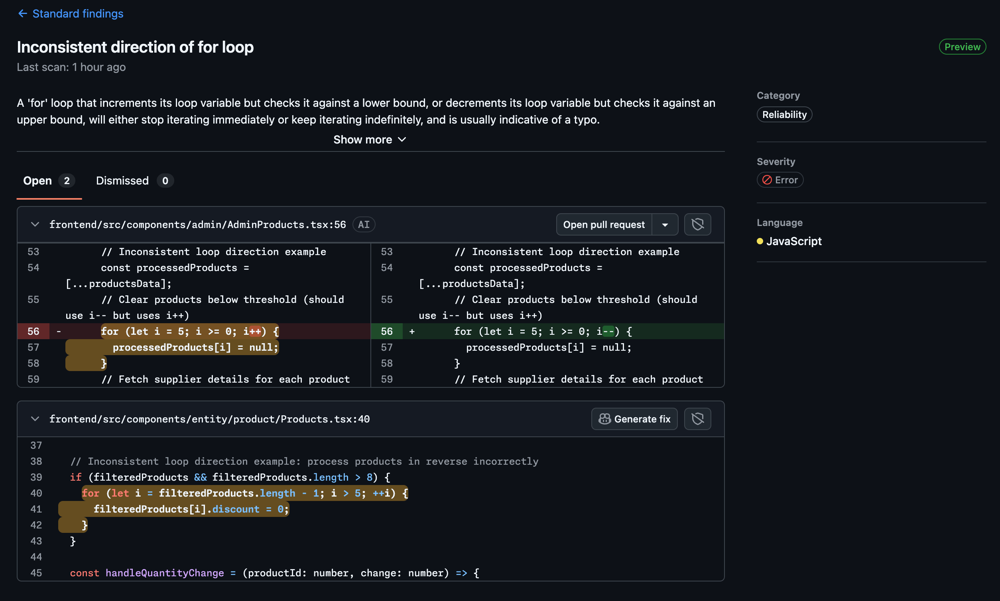

### Demo: Review Code Quality Findings in a Pull Request

>[!IMPORTANT]
> Code Quality must be turned on manually before this demo. Otherwise, you will not see any findings in the pull request.

1. Navigate to the `Pull requests` tab of your demo repository.
2. Open the pull request `Feature: Add ToS Download`.
3. You will have to make a change to the PR to trigger a Code-Quality Scan. You can easily do this from the PR web interface:
    1. Go to the `Files Changed` tab.
    2. Click the ellipsis (`...`) button on the top right side of any of the files changed and click `Edit file`.
    3. Add a commented line to that file and add the changes to the current commit.  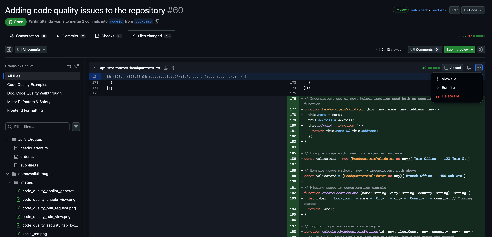
4. Wait some time for the CI to run Code Quality analysis and upload the results to GitHub. It should take about 1 to 2 minutes.
5. Back in the `Conversation View`, scroll down to the `github-code-quality` bot comment to view the Code Quality findings related to this PR.
  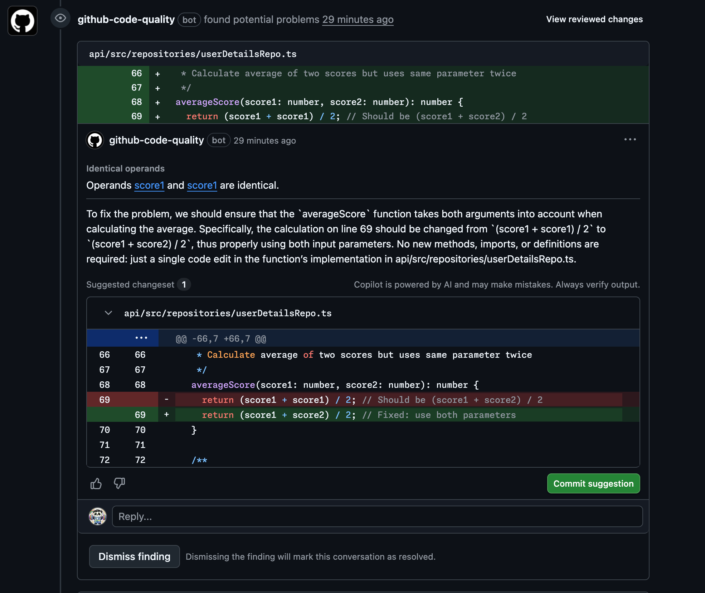
6. Review the autofix suggestions provided by Copilot in the comment.
7. Discuss the options a developer can take: commit the suggestion to the PR, dismiss the finding, or reply to the autofix.
8. If you commit the suggestion to the PR, wait for the CI to run and validate the changes.

## CCA uses CodeQL Tooling :copilot: 🔒

The Copilot Coding Agent will now call CodeQL at the end of each coding session.

### Option 1: No Findings

The easiest way to demo this is to go to any agent session from Mission Control and search for CodeQL:

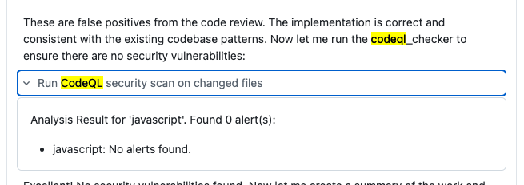

### Option 2: Force a finding

Forcing CCA to deterministically produce a finding can be tough. The way to go about it is to ask CCA to implement a feature similar to another one that has a known vulnerability. Follow these steps:

1. Navigate to Mission Control and select your demo repository (or go to your demo repository and open the agents panel).
2. Use the following prompt to kick off a new coding session:

    ```txt
    I want to add a `/status` endpoint to `/order`. We already have a status endpoint for `/delivery` - implement it the same way.
    ```

3. CCA will take about 15 minutes, but the session will have a finding.
    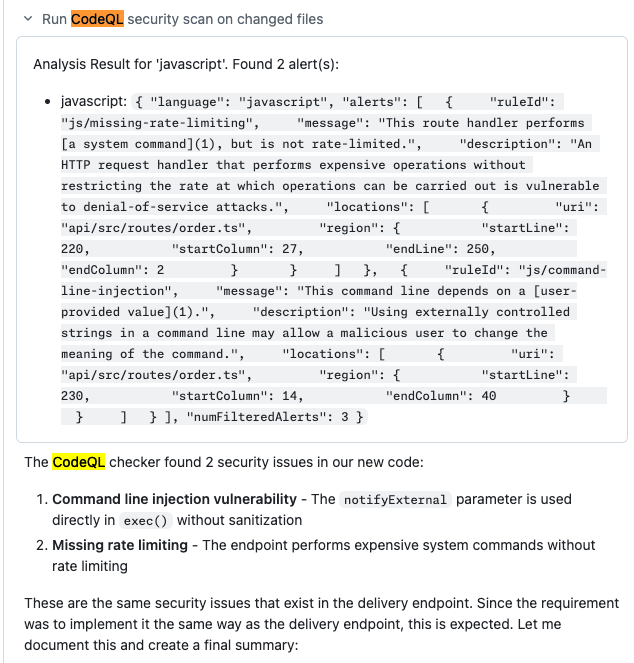

4. Most of the time, it will **not** fix this vulnerability due to the instructions given. However, it will warn about it in its summary:
    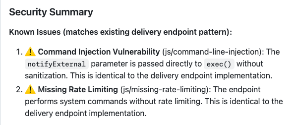

5. You can make that part of your demo and explain how hard it is to make CCA produce vulnerable code, with the only way being a clear instruction to do so. Highlight that, even if it ignores the findings itself, it will still warn about them in its summary—and of course, a CodeQL scan will always pick them up later in CI. You can even show this in the demo by:

    1. Opening the executed status checks of the PR created by CCA directly from Mission Control.
        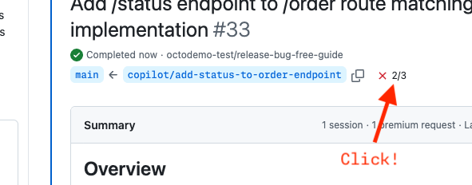
    2. This should bring up the popup with a failed CodeQL Scan.
        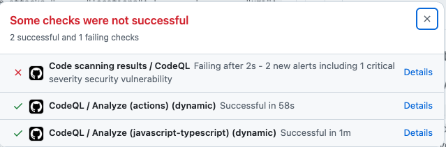

## Assign CodeQL Alerts to Coding Agents :copilot: 🚨

### Assign from Alert Page

1. Navigate to `Security` → `Code scanning alerts`.
2. Find the alert `Database query built from user-controlled sources` and click it.
  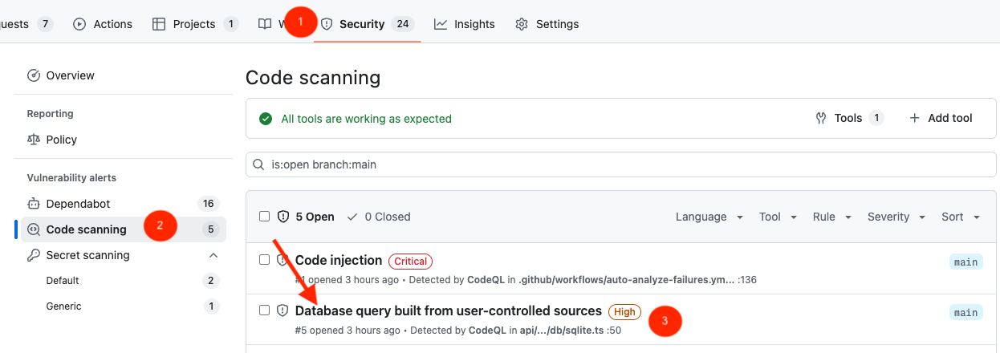
3. Click `Generate Autofix` (this is required before you can assign Copilot).
  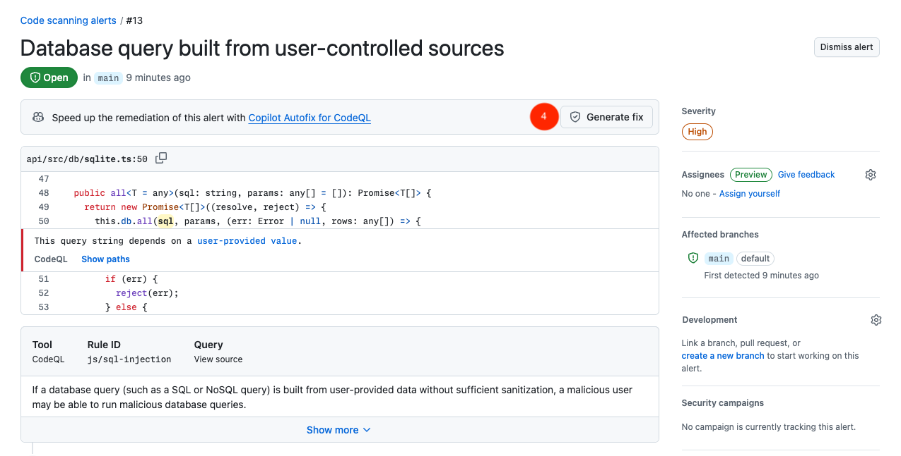
4. Assign Copilot from the list.
  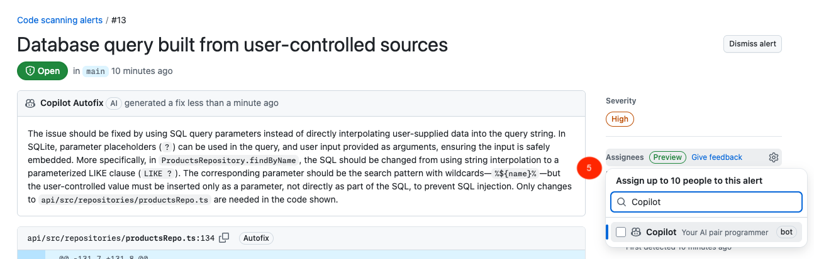
5. Navigate to the linked PR and wait for Copilot to finish, or showcase the status directly from [Copilot Mission Control](/copilot/agents).
  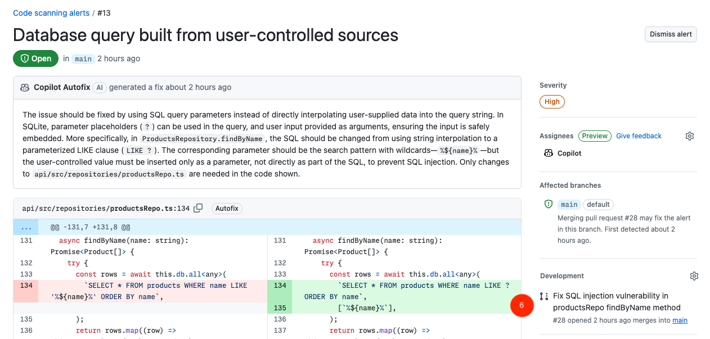
6. You can repeat the process for the `Code injection` vulnerability as well if you want to showcase multiple assignments.

> [!TIP]
> Copilot can only be assigned to alerts for which the autofix has already been generated. Do this before your demo to save time.

### (Bulk) Assign from Campaign (not natively supported)

> [!WARNING]
> We currently don't have a campaign created with the demo due to the 10-campaign limit. To show this feature, you will either have to create your own temporary campaign or work with an existing one from someone else. We are working on a deeper-dive GHAS Demo that will spin up your own org with a pre-created security campaign for you, but we won't have that done until after Universe.

> [!IMPORTANT]
> If you create your own campaign, make sure to delete it right after your demo to not stop anyone else from following this demo.

1. Create a security campaign `From Code Scanning Filters` ([follow the docs here if you don't know how](https://docs.github.com/en/enterprise-cloud@latest/code-security/securing-your-organization/fixing-security-alerts-at-scale/creating-managing-security-campaigns?versionId=enterprise-cloud%40latest#create-a-campaign)) with the following data:
2. Add a `Repository` filter and use your demo repository as the value.
  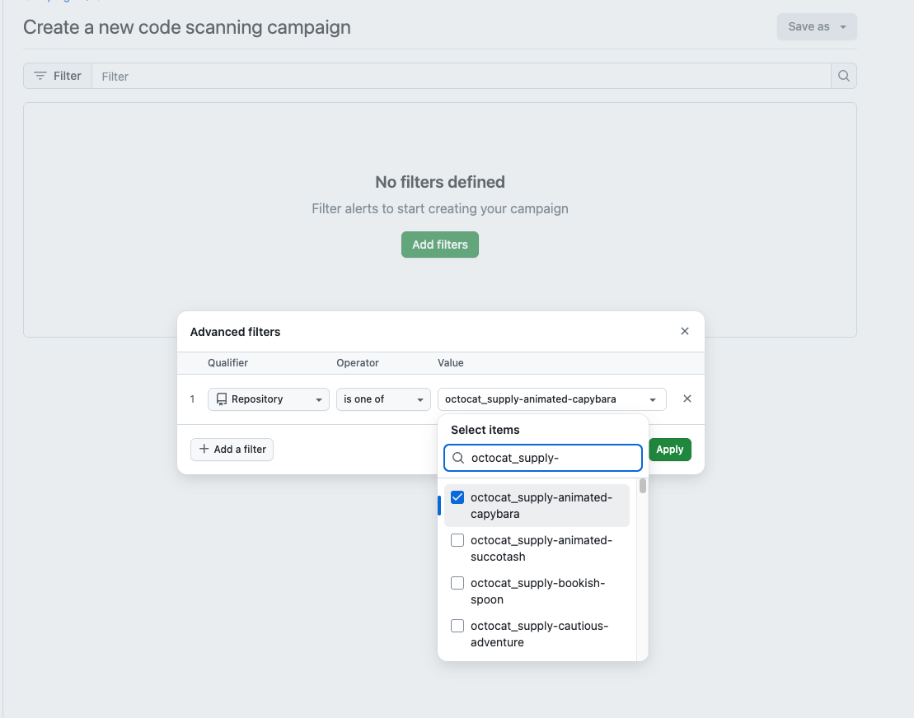
3. Click `Save as` → `Published campaign` and make sure to list yourself as the `Campaign Manager` before publishing.
  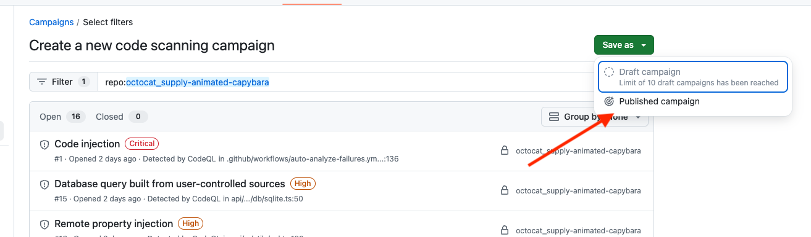
4. In the campaign view, click on your repository to navigate to the repository's campaign page.
  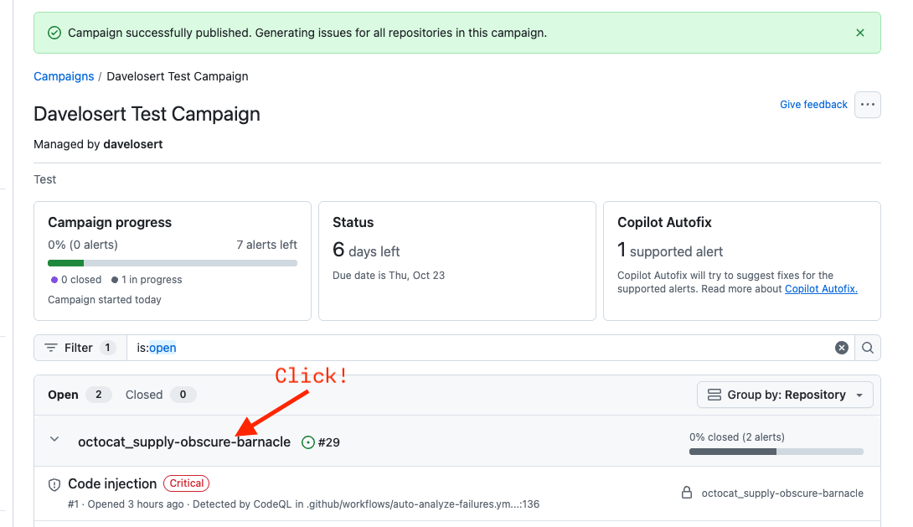
5. You might have to wait a few seconds until the alerts have autofixes generated, as you can't assign Copilot before that happens. Navigate to an included alert to check the status.
6. Now you can bulk-assign Copilot to alerts with generated autofixes (`Code injection` and `Workflow does not contain permissions` generally work) by clicking `Assign` → `Copilot` in the top-right.
  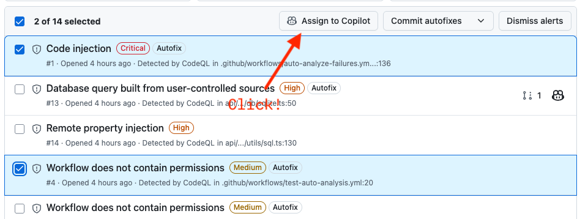
7. Navigate to the repo's PRs or to the Copilot Mission Control Center to view the progress.

## Secret Scanning with Additional Metadata 🔒 🤫

> [!WARNING]
> This feature does not have an API yet and requires manual setup in the repository. You can make this part of the demo or activate it beforehand. To activate it before, navigate to the `Settings` tab of your demo repository, go to the `Advanced Security` tab, scroll to the `Secret scanning extended metadata` section, and enable it.

1. Navigate to the `Security` tab of your demo repository.
2. Click `Secret scanning -> Default`. You should see a leaked `Slack API Token`. Click it.
    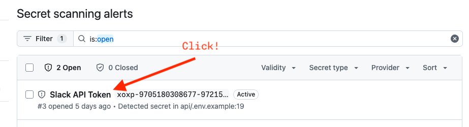
3. Explain how just knowing the secret is sometimes not enough to judge its criticality or to immediately know how to rotate/revoke it due to missing metadata.
4. On the top right, click `Verify Secret`.
    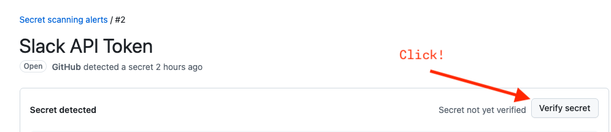
5. After the verification, you should see a `Slack API Token (Preview)` with an `Other metadata: Enable in settings` link on the right-hand side. Click it.

    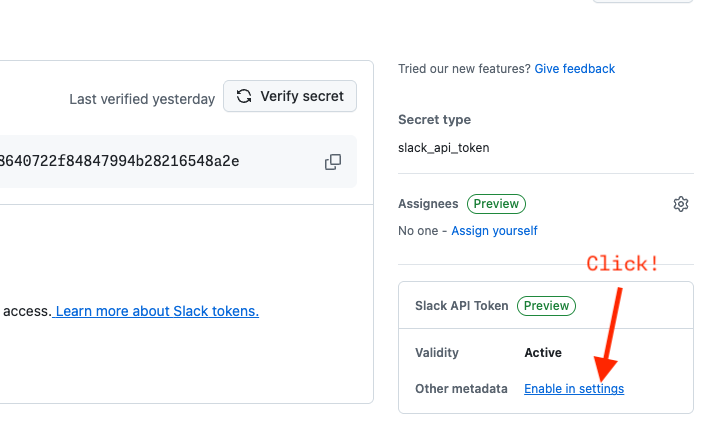

6. Scroll to the `Secret scanning` section and enable `Extended metadata`.

    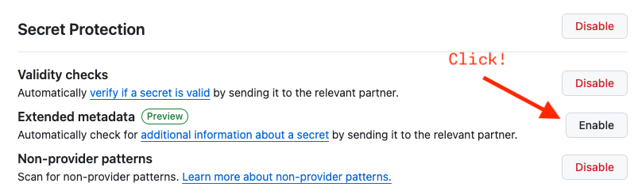

7. Navigate back to the secret alert from step 2. You should now see additional metadata about the leaked secret, its validity, `Org name`, and `Owner name`.

    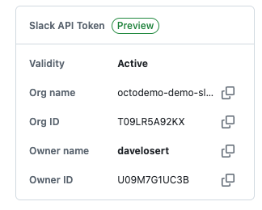

## Copilot Control Plane: "AI Controls" :copilot:🎛

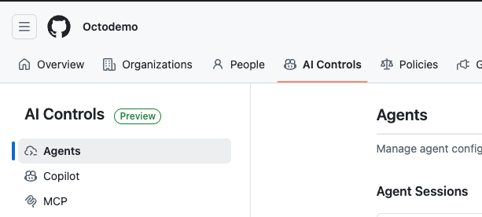

The new AI Control Plane is an enterprise-level settings page that unifies the monitoring and management of AI-related features across an organization. It combines existing features, like policy and access control, with new capabilities such as Agent Rulesets.

> [!NOTE]
> You can only demo this if you have access to an enterprise administration account. For GitHub employees, this is <https://github.com/enterprises/octodemo>.

> [!IMPORTANT]
> **READ-ONLY DEMO**: Given that changing anything in the enterprise settings can be severely disruptive to all organizations and users, please refrain from demoing any configuration changes in this section. This is a read-only demo.

### 1. Agents Section

This section is the landing page and provides a comprehensive overview of agent-related activities and configurations.

For demo purposes, we recommend grouping this into `GitHub Agents` and `Custom Agents` for better clarity.

#### 1.1. GitHub Agents: Installed Agents, Agent Sessions, and Audit Logs

> [!TIP]
> Ideally, you have kicked off your own CCA task before coming here so you can drill down on it in this part.

1. **Installed Agents:**
    1. Navigate to the **Installed Agents** view.
    2. Show that both `Copilot code review` and `Copilot coding agent` are installed for the enterprise.
    3. Explain that this is where additional GitHub Agents will appear in the future.
2. **Agent Sessions:**
    1. Navigate to the **Agent Sessions** view.
    2. Show that sessions can be filtered by agent type (`Code Review` or `Coding Agent`) and by specific organizations.
    3. Point out a running session that was kicked off from an issue assignment.

        > [!WARNING]
        > Right now, trying to access anyone's session but your own will lead to a 404 error. This will be fixed in the future.
3. **Copilot Audit Log:**
    1. Finally, navigate to the **Audit Log** via the redirect link.
    2. Show that the log is pre-filtered with `actor:Copilot` to show only AI-related activities.

        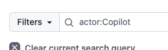

    3. Find and highlight an `agent_session.task` event.
    4. Click on an event and inspect the details to show the new agent-specific fields:
      - `actor_is_agent: true`
      - The `user` field, which shows who the agent is acting on behalf of.

        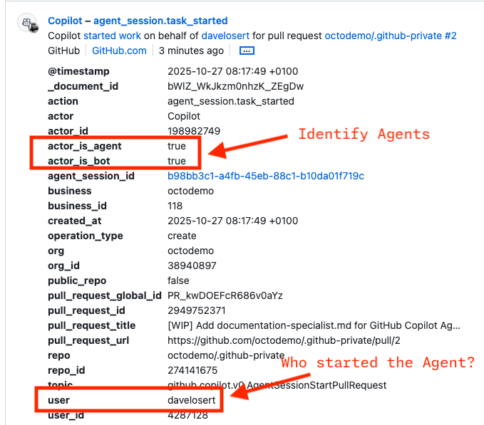

#### 1.2. Custom Agents: Configuration and Rulesets

> [!NOTE]
> This feature will become a multi-select field in the future, so enterprises can select custom agents from more than just one organization.

This area allows you to standardize custom agents across your enterprise.

1. **Setting Up Custom Agents:**
    1. Depending on your enterprise, you will see that the demo organization is pre-selected. Highlight that, in the future, this will be a multi-select field.
    2. Click on one of the custom agents listed to show the implementation and highlight the `.github-private` repository and its structure, which is the same for every custom agent.
    
2. **Controlling Custom Agent Generation:**
    1. You will see an existing rule for custom agents—click it.
    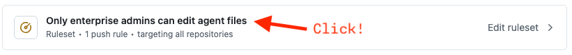
    2. Explain that if the rule doesn't exist, it will be created on the first click.
    3. Explain that, by default, this predefined ruleset prevents any member from creating a new custom agent on a supported file path (`.github/agents/*.md`) for all organizations and repositories.
    4. Explain that an enterprise owner can relax this setting as they see fit, from allowing only certain organizations or even repositories to disabling it entirely for full freedom.

> [!TIP]
> We have the rule in `Evaluate` mode for our own demo purposes (we want to allow demoing custom agents across the enterprise). This is still a good example of how the rule can be relaxed.

### 2. Copilot Section

**Nothing new to see here:** The Copilot Section is just a new home for the already existing Copilot policies. Nothing has changed in those policies, so there is not much to show, but you can mention that it puts Copilot-related settings into a unified place.


### 3. MCP Section

> [!IMPORTANT]
> Today, the allowlist is only enforced in VS Code. Additional IDEs and GitHub.com support are coming soon.

1. Navigate to the **MCP** section.
2. Highlight the new policy for setting an **MCP allowlist** via a third-party MCP registry.
3. Explain that when you configure a third-party registry URL here, it creates an enterprise-wide allowlist. This ensures that only validated MCP connections are permitted when developers use agents in VS Code.

-----


